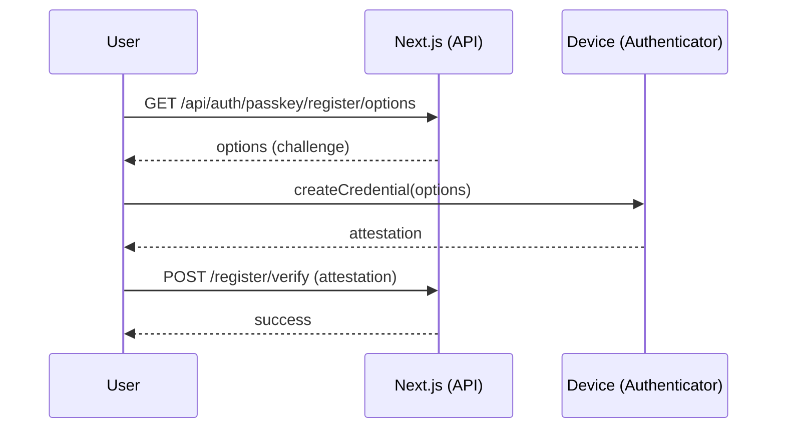
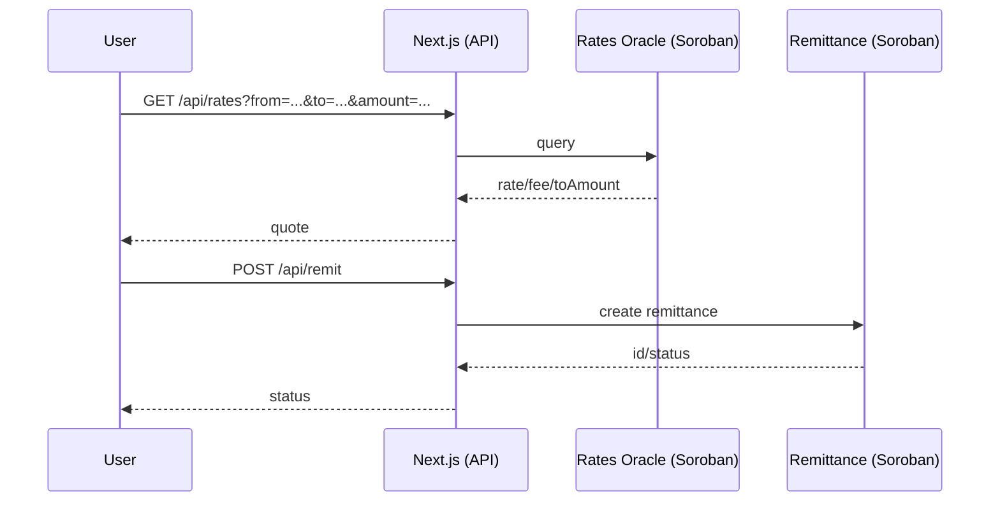

# 🧭 Architecture — KaleConnect (EN)

This document outlines KaleConnect's high-level architecture, core components, data flows, and external integrations.

## Overview

```mermaid
flowchart LR
  subgraph Client[Client]
    UI[Next.js App (Web)]
    Wallets[Wallets: Freighter / MetaMask / etc.]
  end

  subgraph WebApp[Web Application (kaleconnect-web)]
    API[Next.js App Router\nRoute Handlers]
    Libs[Libraries: soroban/*, wallets, elisa, webauthn]
  end

  subgraph Services[External Services]
    Horizon[Stellar Horizon API]
    Eliza[ElizaOS API]
  end

  subgraph Soroban[Stellar Soroban]
    KYC[KYC Registry]
    Rates[Rates Oracle]
    Remit[Remittance]
  end

  UI <--> API
  API <---> Libs
  Libs -- HTTP --> Horizon
  Libs -- HTTP --> Eliza
  Libs -- RPC --> KYC
  Libs -- RPC --> Rates
  Libs -- RPC --> Remit

  Wallets -. Signing .- UI
```

## Components

- UI (`kaleconnect-web/src/app`, `src/components`)
- Route Handlers (`kaleconnect-web/src/app/api/*`)
- Integration libraries (`kaleconnect-web/src/lib/*`)
- Smart Contracts (`contracts/*`)

## Key Flows

1) Passkey Authentication (WebAuthn)


2) Quote and Remittance


## Security Considerations

- Passwordless login via WebAuthn
- Input validation with Zod in API routes
- Secrets via environment variables
- Prefer SSH for Git operations

## Scalability

- App Router with lightweight handlers
- Offload settlement logic to Soroban
- Optional caching for rates and async audit processing
