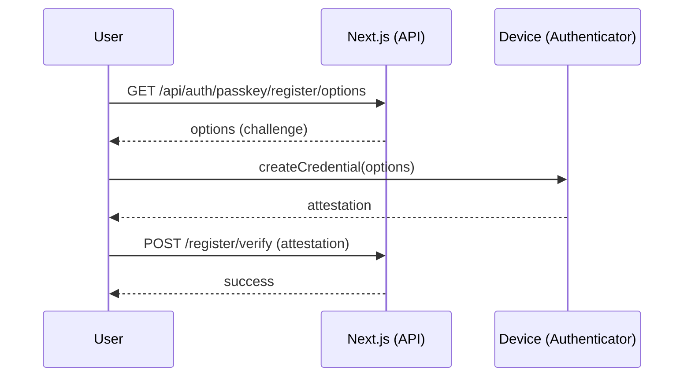
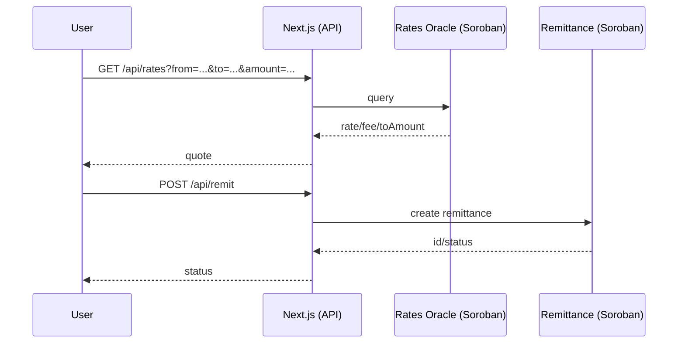

# 🧭 Technical Architecture — KaleConnect (EN)

**Complete technical overview of KaleConnect system architecture.**

This document outlines KaleConnect's high-level architecture, core components, data flows, external integrations, and the latest implementations of the real data system and advanced interface.

## Overview

```mermaid
flowchart LR
  subgraph Client[Client]
    UI[Next.js App (Web)]
    Wallets[Wallets: Freighter / MetaMask / etc.]
  end

  subgraph WebApp[Web Application (kaleconnect-web)]
    API[Next.js App Router\nRoute Handlers]
    Libs[Libraries: soroban/*, wallets, elisa, webauthn]
  end

  subgraph Services[External Services]
    Horizon[Stellar Horizon API]
    Eliza[ElizaOS API]
  end

  subgraph Soroban[Stellar Soroban]
    KYC[KYC Registry]
    Rates[Rates Oracle]
    Remit[Remittance]
  end

  UI <--> API
  API <---> Libs
  Libs -- HTTP --> Horizon
  Libs -- HTTP --> Eliza
  Libs -- RPC --> KYC
  Libs -- RPC --> Rates
  Libs -- RPC --> Remit

  Wallets -. Signing .- UI
```

## Components

- UI (`kaleconnect-web/src/app`, `src/components`)
- Route Handlers (`kaleconnect-web/src/app/api/*`)
- Integration libraries (`kaleconnect-web/src/lib/*`)
- Smart Contracts (`contracts/*`)

## Key Flows

1) Passkey Authentication (WebAuthn)


2) Quote and Remittance


## Security Considerations

- Passwordless login via WebAuthn
- Input validation with Zod in API routes
- Secrets via environment variables
- Prefer SSH for Git operations

## Scalability

- App Router with lightweight handlers
- Offload settlement logic to Soroban
- Optional caching for rates and async audit processing

---

## 🚀 Production Deployment

### Active Infrastructure

#### Vercel (Frontend + Backend)
- **🌐 Main URL**: https://kaleconnect-qr6bjqgaa-jistrianes-projects.vercel.app
- **🔍 Dashboard**: https://vercel.com/jistrianes-projects/kaleconnect-web
- **🌍 Network**: Stellar Testnet
- **⚡ Status**: Operational 24/7

#### Active Backend APIs
```
/api/health      - Health check with detailed metrics
/api/monitoring  - Prometheus observability
/api/auth/*      - WebAuthn/Passkey authentication
/api/kyc/*       - KYC Registry integration
/api/rates       - Real-time exchange rates
/api/remit/*     - International remittances
/api/elisa/chat  - AI assistant chat
/api/audit       - Cryptographic audit logs
```

#### Production Configuration
- **Rate Limiting**: 20 requests/minute per IP
- **Monitoring**: Structured logs + real-time metrics
- **Security**: CSP headers, HSTS, cryptographic audit
- **Performance**: Optimized middleware + intelligent cache
- **CI/CD**: Automatic deployment via GitHub Actions

#### Soroban Contracts (Testnet)
- **KYC Registry**: `CBB5WR3SLYGQH3ORNPVZWEIDZCL3SXLPWOHI3KPAN2M62E4MQA7PXSF4`
- **Rates Oracle**: `CAJKLOFR32AQTYT5RU4FLPKKLB7PBBY3IBIFQKLLRLRCQLPWBRJMIIQT`
- **Remittance**: `CAGDTDNJHGBYTLDDLCGTZ2A75F4MFQSTYHJVBOJV3TWIY623GS2MZUFN`
