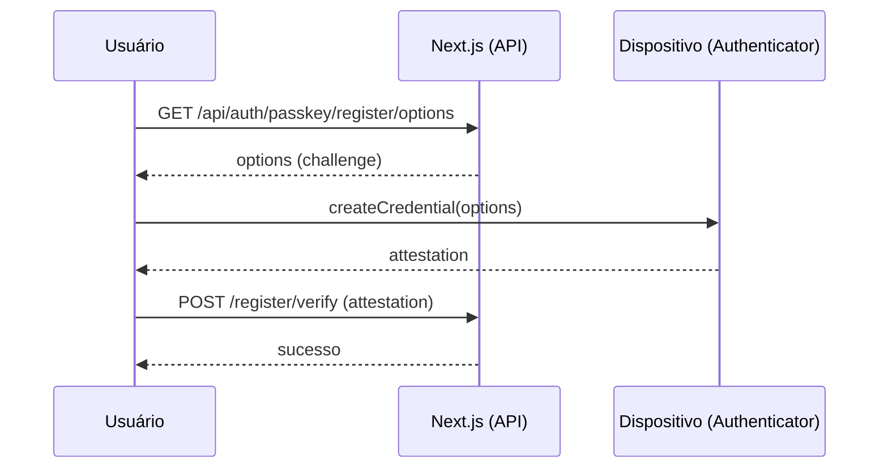
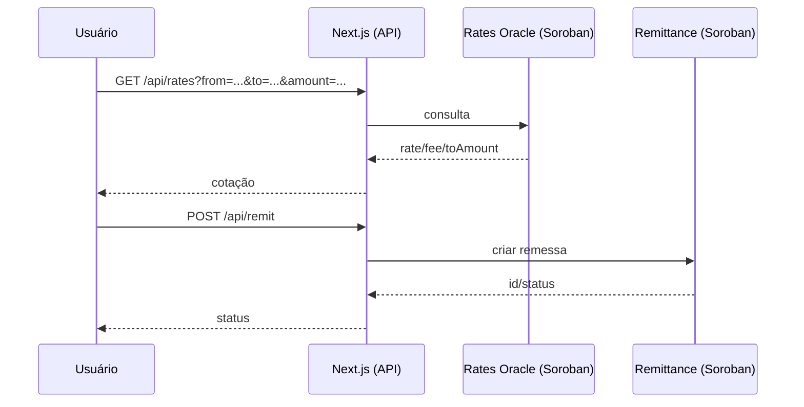

# 🧭 Arquitetura — KaleConnect (PT-BR)

Este documento descreve a arquitetura de alto nível do KaleConnect, seus componentes principais, fluxos de dados e integrações externas.

## Visão Geral

```mermaid
flowchart LR
  subgraph Client[Cliente]
    UI[Next.js App (Web)]
    Wallets[Carteiras: Freighter / MetaMask / etc.]
  end

  subgraph WebApp[Aplicação Web (kaleconnect-web)]
    API[Next.js App Router\nRoute Handlers]
    Libs[Libs: soroban/*, wallets, elisa, webauthn]
  end

  subgraph Services[Serviços Externos]
    Horizon[Stellar Horizon API]
    Eliza[ElizaOS API]
  end

  subgraph Soroban[Stellar Soroban]
    KYC[KYC Registry]
    Rates[Rates Oracle]
    Remit[Remittance]
  end

  UI <--> API
  API <---> Libs
  Libs -- HTTP --> Horizon
  Libs -- HTTP --> Eliza
  Libs -- RPC --> KYC
  Libs -- RPC --> Rates
  Libs -- RPC --> Remit

  Wallets -. Assinatura .- UI
```

## Componentes

- UI (`kaleconnect-web/src/app`, `src/components`)
- Route Handlers (`kaleconnect-web/src/app/api/*`)
- Bibliotecas de integração (`kaleconnect-web/src/lib/*`)
- Smart Contracts (`contracts/*`)

## Fluxos Principais

1) Autenticação Passkey (WebAuthn)


2) Cotação e Remessa


## Considerações de Segurança

- WebAuthn para login sem senha
- Validação com Zod nas rotas
- Segredos via variáveis de ambiente
- Preferir SSH em operações Git

## Escalabilidade

- App Router com rotas leves
- Offload de lógica de liquidação para Soroban
- Possível cache de cotações e auditoria assíncrona
