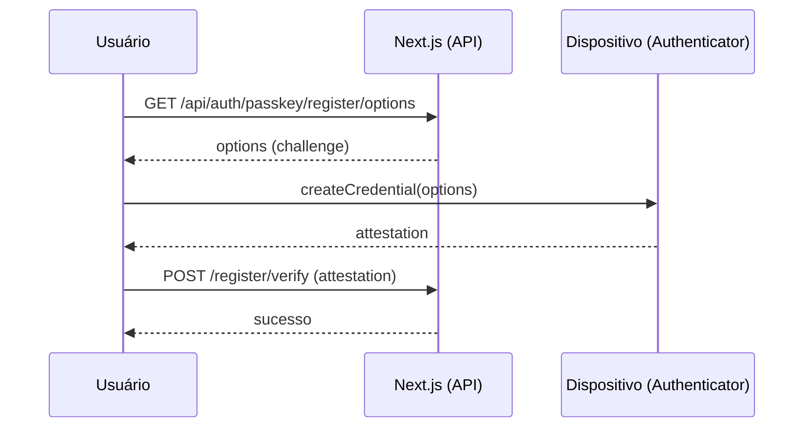
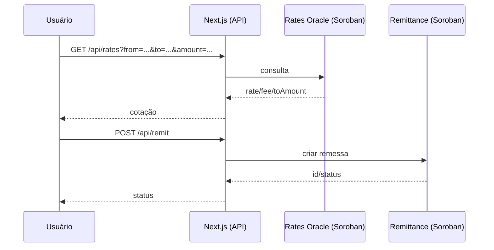

# 🧭 Arquitetura Técnica — KaleConnect (PT-BR)

**Visão técnica completa da arquitetura do sistema KaleConnect.**

Este documento descreve a arquitetura de alto nível do KaleConnect, seus componentes principais, fluxos de dados, integrações externas e as implementações mais recentes do sistema de dados reais e interface avançada.

## Visão Geral

```mermaid
flowchart LR
  subgraph Client[Cliente]
    UI[Next.js App (Web)]
    Wallets[Carteiras: Freighter / MetaMask / etc.]
  end

  subgraph WebApp[Aplicação Web (kaleconnect-web)]
    API[Next.js App Router\nRoute Handlers]
    Libs[Libs: soroban/*, wallets, elisa, webauthn]
  end

  subgraph Services[Serviços Externos]
    Horizon[Stellar Horizon API]
    Eliza[ElizaOS API]
  end

  subgraph Soroban[Stellar Soroban]
    KYC[KYC Registry]
    Rates[Rates Oracle]
    Remit[Remittance]
  end

  UI <--> API
  API <---> Libs
  Libs -- HTTP --> Horizon
  Libs -- HTTP --> Eliza
  Libs -- RPC --> KYC
  Libs -- RPC --> Rates
  Libs -- RPC --> Remit

  Wallets -. Assinatura .- UI
```

## Componentes

- UI (`kaleconnect-web/src/app`, `src/components`)
- Route Handlers (`kaleconnect-web/src/app/api/*`)
- Bibliotecas de integração (`kaleconnect-web/src/lib/*`)
- Smart Contracts (`contracts/*`)

## Fluxos Principais

1) Autenticação Passkey (WebAuthn)


2) Cotação e Remessa


## Considerações de Segurança

- WebAuthn para login sem senha
- Validação com Zod nas rotas
- Segredos via variáveis de ambiente
- Preferir SSH em operações Git

## Escalabilidade

- App Router com rotas leves
- Offload de lógica de liquidação para Soroban
- Possível cache de cotações e auditoria assíncrona

---

## 🚀 Deploy em Produção

### Infraestrutura Ativa

#### Vercel (Frontend + Backend)
- **🌐 URL Principal**: https://kaleconnect-qr6bjqgaa-jistrianes-projects.vercel.app
- **🔍 Dashboard**: https://vercel.com/jistrianes-projects/kaleconnect-web
- **🌍 Rede**: Stellar Testnet
- **⚡ Status**: Operacional 24/7

#### Backend APIs Ativas
```
/api/health      - Health check com métricas detalhadas
/api/monitoring  - Observabilidade Prometheus
/api/auth/*      - WebAuthn/Passkey authentication
/api/kyc/*       - KYC Registry integration
/api/rates       - Real-time exchange rates
/api/remit/*     - International remittances
/api/elisa/chat  - AI assistant chat
/api/audit       - Cryptographic audit logs
```

#### Configurações de Produção
- **Rate Limiting**: 20 requisições/minuto por IP
- **Monitoramento**: Logs estruturados + métricas em tempo real
- **Segurança**: Headers CSP, HSTS, auditoria criptográfica
- **Performance**: Middleware otimizado + cache inteligente
- **CI/CD**: Deploy automático via GitHub Actions

#### Contratos Soroban (Testnet)
- **KYC Registry**: `CBB5WR3SLYGQH3ORNPVZWEIDZCL3SXLPWOHI3KPAN2M62E4MQA7PXSF4`
- **Rates Oracle**: `CAJKLOFR32AQTYT5RU4FLPKKLB7PBBY3IBIFQKLLRLRCQLPWBRJMIIQT`
- **Remittance**: `CAGDTDNJHGBYTLDDLCGTZ2A75F4MFQSTYHJVBOJV3TWIY623GS2MZUFN`
