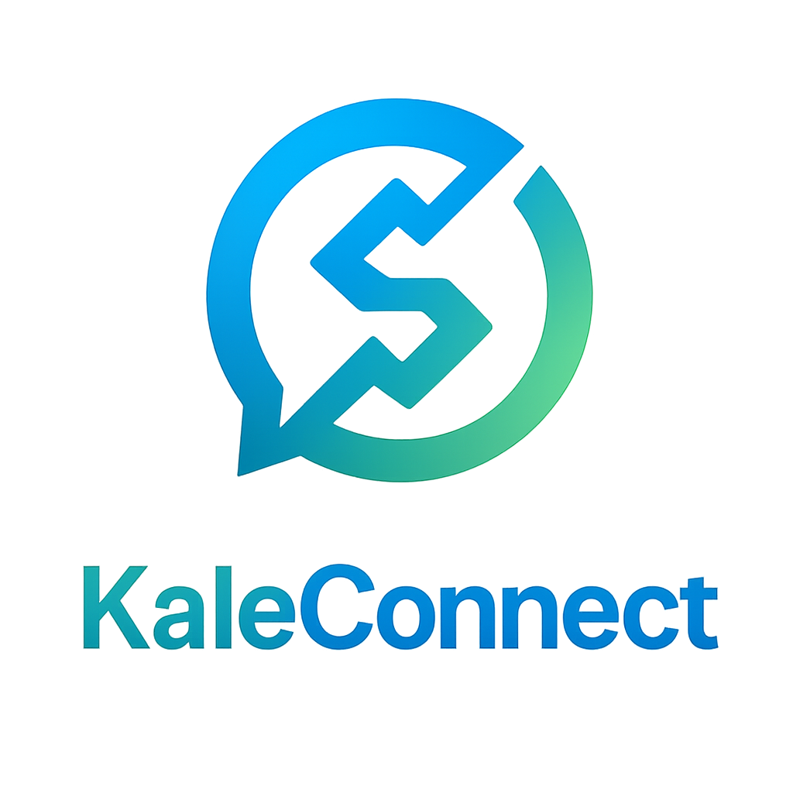

# 🌿 KaleConnect - Remessas Inteligentes Multichain

**Uma plataforma global de remessas digitais tão fácil quanto conversar no WhatsApp, mas extremamente poderosa, segura e inclusiva.**



## 🎯 Visão Geral

KaleConnect é uma plataforma inovadora de remessas internacionais que combina a simplicidade de um chat com a segurança e eficiência da tecnologia blockchain. Desenvolvida para atender às necessidades da diáspora, migrantes e familiares que precisam enviar/receber dinheiro com rapidez, baixo custo e máxima praticidade.

### ✨ Diferenciais-Chave

- 🔗 **Liquidação Multi-chain Real-time** usando Stellar + Kale Reflector
- 💼 **Suporte a Múltiplas Carteiras**: Stellar, EVM, Bitcoin e outras blockchains populares
- 🔐 **Autenticação Sem Senha (Passkey)**: Login via biometria/dispositivo usando WebAuthn
- 🤖 **Assistente Inteligente ElisaOS**: IA para onboarding, suporte e educação financeira
- 🌍 **Experiência Bilíngue**: Interface em Português (PT-BR) e Inglês
- 💰 **Transparência Total**: Cálculo prévio de valores, taxas e tempo de transação

## 🚀 Começando

### Pré-requisitos

- Node.js 18+ 
- npm ou yarn

### Instalação e Execução

1. **Clone o repositório**
   ```bash
   git clone <repository-url>
   cd KaleConnect/kaleconnect-web
   ```

2. **Instale as dependências**
   ```bash
   npm install
   ```

3. **Execute o servidor de desenvolvimento**
   ```bash
   npm run dev
   ```

4. **Acesse a aplicação**
   - Abra [http://localhost:3000](http://localhost:3000) no seu navegador
   - A porta pode variar se 3000 estiver ocupada

### Scripts Disponíveis

```bash
npm run dev      # Inicia o servidor de desenvolvimento com Turbopack
npm run build    # Cria a build de produção
npm run start    # Inicia o servidor de produção
npm run lint     # Executa o linter
```

## 🏗️ Arquitetura

### Frontend
- **Next.js 15.5.0** com App Router
- **React 19** para interface reativa
- **Tailwind CSS 4** para estilização
- **TypeScript** para type safety
- **WebAuthn** para autenticação sem senha

### Blockchain & Wallets
- **Stellar SDK** para transações XLM
- **Freighter API** para integração com carteiras Stellar
- **Ethers.js** para suporte EVM
- **Multi-chain** via Kale Reflector

### IA & Assistente
- **ElizaOS Core** para o assistente inteligente
- **Next-intl** para internacionalização
- **Zod** para validação de dados

## 🎮 Funcionalidades Principais

### 🔐 Autenticação Segura
- **Passkey/WebAuthn**: Login sem senha usando biometria
- **Multi-device**: Suporte a múltiplos dispositivos
- **Privacy by default**: Identidade Web3 automática

### 💼 Gestão de Carteiras
- **Criação automática**: Carteira XLM nativa
- **Importação**: Suporte a seed phrases e chaves privadas
- **Conexão externa**: MetaMask, Freighter, TrustWallet via WalletConnect
- **Multi-chain**: Stellar, Ethereum, e outras redes

### 💬 Interface de Chat
- **Conversas naturais**: Envio de dinheiro via chat
- **Contatos**: Lista de contatos com @handles únicos
- **Histórico**: Todas as transações e mensagens organizadas
- **Bilíngue**: Português e Inglês com detecção automática

### 🤖 Assistente ElisaOS
- **Onboarding guiado**: Tutorial interativo para novos usuários
- **Suporte 24/7**: Dúvidas sobre transações e funcionalidades
- **Educação financeira**: Dicas e melhores práticas
- **Detecção de fraudes**: Alertas de segurança proativos

### 💰 Sistema de Remessas
- **Cálculo transparente**: Taxas e valores finais antes do envio
- **Múltiplas moedas**: XLM, USDC, BRL, USD e outras
- **Liquidação rápida**: Transações em minutos via Stellar
- **Cross-chain**: Interoperabilidade entre diferentes blockchains

## 🔧 Estrutura do Projeto

```
kaleconnect-web/
├── src/
│   ├── app/                 # Next.js App Router
│   │   ├── api/            # API Routes (backend mocks)
│   │   │   ├── auth/       # Autenticação WebAuthn
│   │   │   ├── kyc/        # Know Your Customer
│   │   │   ├── remit/      # Remessas
│   │   │   ├── rates/      # Cotações
│   │   │   └── elisa/      # Chat IA
│   │   ├── chat/           # Interface de chat
│   │   ├── kyc/            # Página KYC
│   │   ├── remittances/    # Histórico de remessas
│   │   └── audit/          # Auditoria e compliance
│   ├── components/         # Componentes React
│   │   ├── ElisaChat.tsx   # Interface do assistente IA
│   │   ├── Navbar.tsx      # Navegação principal
│   │   └── WalletButtons.tsx # Botões de carteira
│   ├── lib/                # Utilitários e integrações
│   │   ├── soroban/        # Contratos Stellar Soroban
│   │   ├── wallets.ts      # Gestão de carteiras
│   │   ├── elisa.ts        # Integração ElizaOS
│   │   └── webauthn.ts     # Autenticação WebAuthn
│   └── types/              # Definições TypeScript
├── public/                 # Assets estáticos
└── contracts/              # Smart contracts

## 🔌 API Endpoints

Todos os endpoints são implementados como Next.js App Router route handlers em `src/app/api/`.

### 🏥 Health Check
- `GET /api/health` - Status da aplicação

### 🔐 Autenticação WebAuthn/Passkey
- `GET /api/auth/passkey/register/options?username=<email>` - Opções de registro
- `POST /api/auth/passkey/register/verify` - Verificação do registro
- `GET /api/auth/passkey/login/options?username=<email>` - Opções de login
- `POST /api/auth/passkey/login/verify` - Verificação do login

### 📋 KYC (Know Your Customer)
- `POST /api/kyc/start` - Iniciar processo KYC
  ```json
  { "userId": "string" }
  ```
- `GET /api/kyc/status?id=<kycId>` - Status do KYC
  - Progresso: `pending → review → approved`

### 💸 Remessas
- `POST /api/remit` - Criar remessa
  ```json
  { "from": "XLM", "to": "USDC", "amount": 50 }
  ```
- `GET /api/remit/[id]` - Status da remessa
  - Progresso: `created → submitted → settled`

### 💱 Cotações
- `GET /api/rates?from=XLM&to=BRL&amount=100` - Obter cotação
  ```json
  { "from": "XLM", "to": "BRL", "amount": 100, "rate": 0.5, "feePct": 0.01, "toAmount": 49.5 }
  ```

### 🤖 Chat com ElisaOS
- `POST /api/elisa/chat` - Interagir com o assistente IA

### 📊 Auditoria
- `GET /api/audit` - Logs de auditoria e compliance

## 💡 Exemplos de Uso

### Curl Examples

```bash
# Iniciar KYC
curl -s -X POST http://localhost:3000/api/kyc/start \
  -H 'content-type: application/json' \
  -d '{"userId":"user123"}'

# Verificar status do KYC
curl -s 'http://localhost:3000/api/kyc/status?id=KYC_ID'

# Criar remessa
curl -s -X POST http://localhost:3000/api/remit \
  -H 'content-type: application/json' \
  -d '{"from":"XLM","to":"USDC","amount":50}'

# Verificar remessa
curl -s http://localhost:3000/api/remit/REMIT_ID

# Obter cotação
curl -s 'http://localhost:3000/api/rates?from=XLM&to=BRL&amount=100'
```

## 🚀 Deployment

### Vercel (Recomendado)
1. Conecte seu repositório GitHub ao Vercel
2. Configure as variáveis de ambiente necessárias
3. Deploy automático a cada push

#### Produção (Vercel) — Configuração atual
- **Projeto Vercel**: https://vercel.com/jistrianes-projects/kaleconnect-web
- **URL de Produção**: https://kaleconnect-it15fc381-jistrianes-projects.vercel.app
- **Rede**: Stellar Soroban Testnet
- **Variáveis de ambiente (Production)**:
  - `NEXT_PUBLIC_SOROBAN_RPC = https://soroban-testnet.stellar.org`
  - `NEXT_PUBLIC_STELLAR_NETWORK_PASSPHRASE = Test SDF Network ; September 2015`
  - `NEXT_PUBLIC_CONTRACT_ID_REMITTANCE = CCVIO6YVRPWOGH5RVXTTCZQPPABUZCNUEAVB75SRZDS3ECFOTFSXZOQ4`
  - `NEXT_PUBLIC_CONTRACT_ID_KYC = CDGUWD4KJHGLGNEFUS2E6N5MDL7Z34IACKEYD6ZC3DB7IS47MHLKKJG6`
  - `NEXT_PUBLIC_CONTRACT_ID_RATES = CDAREYRUQPR6C5PRJIBEREP5IM2UJ2YOPCFDMYNMMORSTFSH2NIXK5G6`
  - `APP_CRYPTO_SECRET` (gerado aleatoriamente)
  - `AUDIT_LOG_SECRET` (gerado aleatoriamente)

Notas:
- O arquivo `vercel.json` foi ajustado para Next.js (sem `framework`, `buildCommand` e `outputDirectory`).
- Correção de lint aplicada em `src/lib/wallets.ts` para permitir o build na Vercel.
- Para habilitar a IA/Eliza, configure também `OPENAI_API_KEY` (server-side).

Referências úteis:
- Explorador Testnet: https://stellar.expert/explorer/testnet

### Docker
```bash
# Build da imagem
docker build -t kaleconnect-web .

# Executar container
docker run -p 3000:3000 kaleconnect-web
```

### Manual
```bash
npm run build
npm run start
```

## 🌟 Roadmap

- [ ] **MVP Hackathon**
  - [x] Autenticação WebAuthn/Passkey
  - [x] Interface de chat bilíngue
  - [x] Integração ElisaOS
  - [x] APIs mock para remessas
  - [ ] Integração Stellar real
  - [ ] Suporte a múltiplas carteiras

- [ ] **Fase 2**
  - [ ] Kale Reflector para cross-chain
  - [ ] KYC automatizado
  - [ ] Cash-in/Cash-out com parceiros
  - [ ] App mobile (React Native)

- [ ] **Fase 3**
  - [ ] Staking e yield farming
  - [ ] Programa de afiliados
  - [ ] API pública para desenvolvedores
  - [ ] Suporte a mais blockchains

## 🤝 Contribuindo

1. Fork o projeto
2. Crie uma branch para sua feature (`git checkout -b feature/AmazingFeature`)
3. Commit suas mudanças (`git commit -m 'Add some AmazingFeature'`)
4. Push para a branch (`git push origin feature/AmazingFeature`)
5. Abra um Pull Request

## 📄 Licença

Este projeto está sob a licença MIT. Veja o arquivo `LICENSE` para mais detalhes.

## 🙏 Agradecimentos

- **Stellar Development Foundation** - Pela infraestrutura blockchain
- **Kale** - Pelo Reflector e ferramentas Stellar
- **ElizaOS** - Pela plataforma de IA
- **Vercel** - Pelo hosting e ferramentas de desenvolvimento

---

**Desenvolvido com ❤️ para conectar o mundo através de remessas inteligentes e seguras.**
